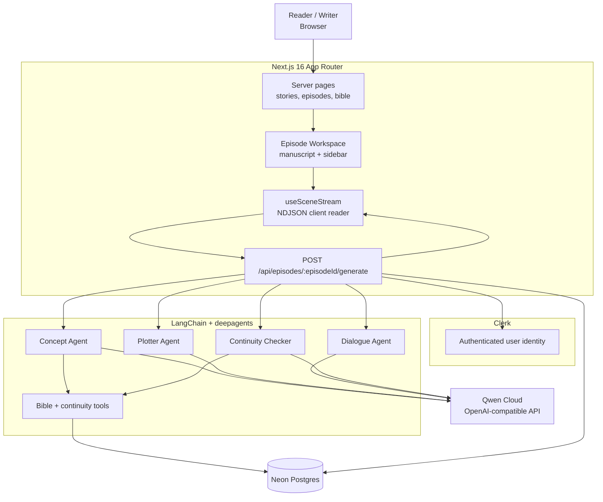
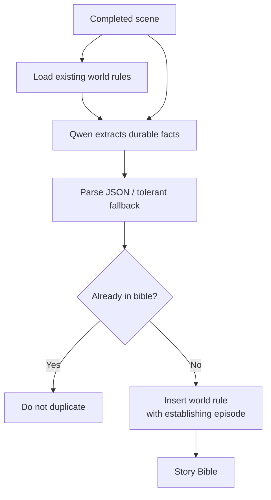
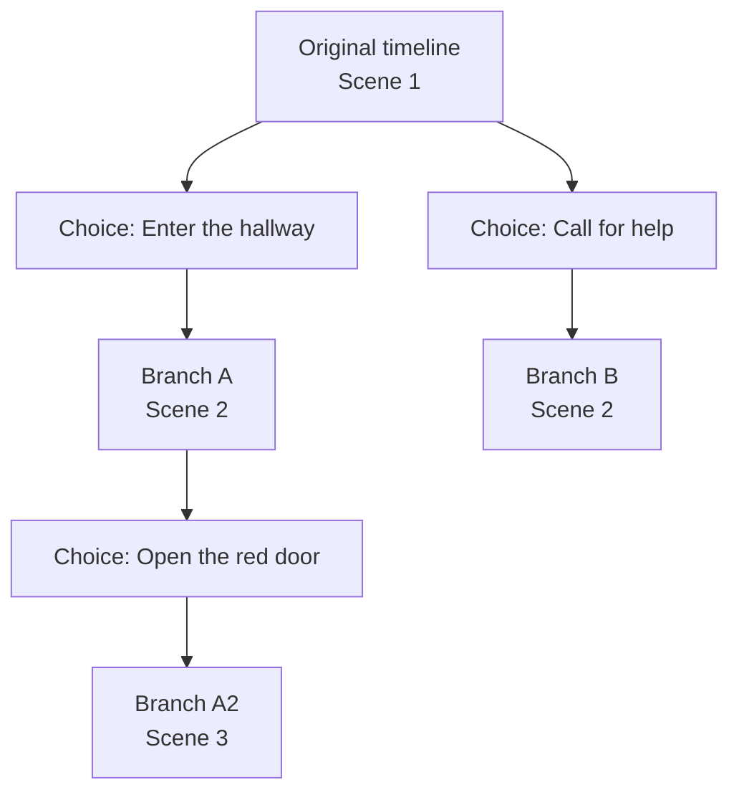
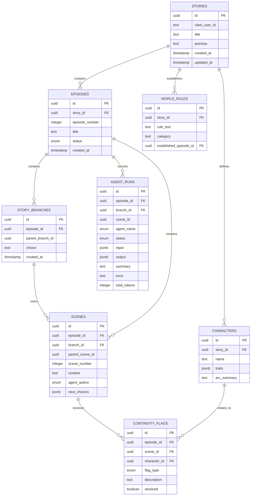
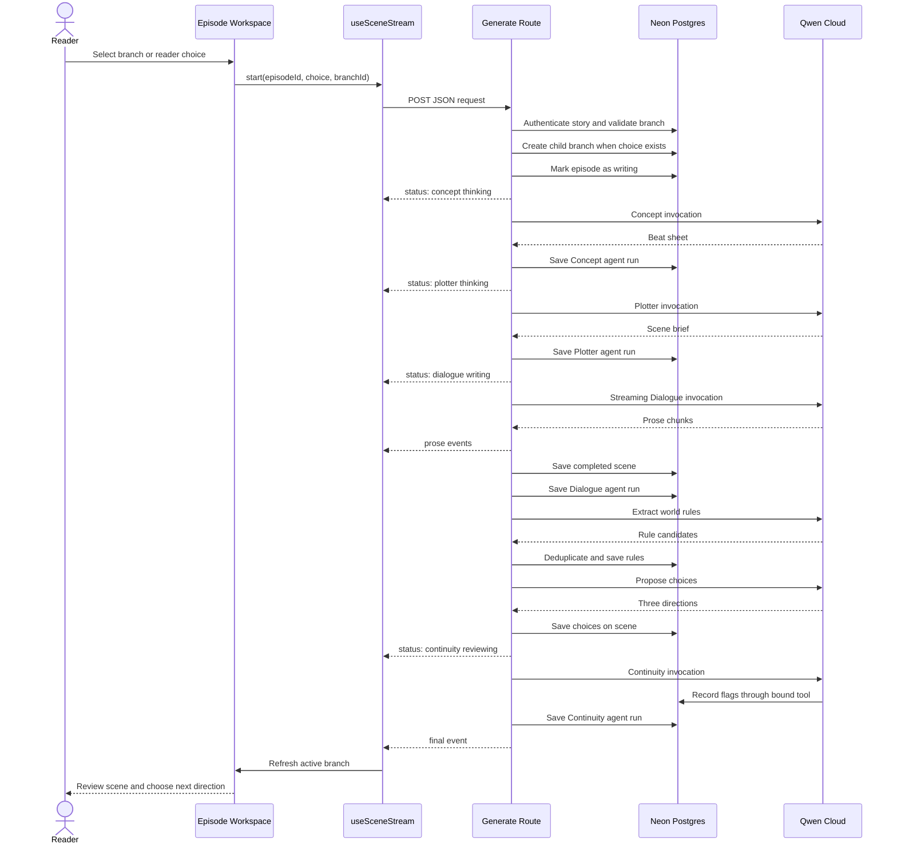
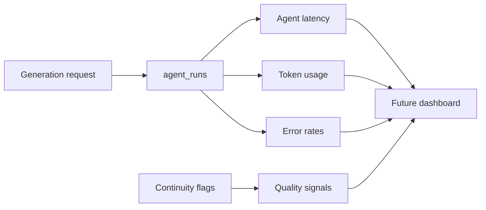

# Loom 🧵

> **Stories that remember. Choices that matter.**
> A multi-agent writers' room for branching interactive fiction, where Concept, Plotter, Dialogue, and Continuity agents collaborate to write episodic stories while a persistent story bible keeps the world coherent.
>
> Built for the **[Global AI Hackathon Series with Qwen Cloud](https://qwencloud-hackathon.devpost.com/)** — Track 2: AI Showrunner, with strong overlap with Track 1: MemoryAgent and Track 3: Agent Society.


---

## What is Loom?

Most AI writing tools give you a prompt box and one answer. Loom gives you a writers' room.

You start with a premise. A Concept Agent finds the next dramatic beat, a Plotter Agent turns it into a scene brief, and a Dialogue Agent writes the scene live in the manuscript. Once the prose is complete, a Continuity Checker compares it against the story bible and marks contradictions, character drift, and unresolved threads.

Then the story hands the decision back to you.

Each finished scene can offer three possible directions. Choose one and Loom creates a persistent branch. The original timeline stays intact, alternate paths remain available, and the next generation receives the relevant inherited story context.

The result is an episodic interactive story that can grow without quietly forgetting what it established earlier.

---

## Table of Contents

- [What is Loom?](#what-is-loom)
- [Why it is interesting](#why-it-is-interesting)
- [What it does](#what-it-does)
- [Tech stack](#tech-stack)
- [Features](#features)
- [System architecture](#system-architecture)
- [The writers' room](#the-writers-room)
- [Story-bible memory](#story-bible-memory)
- [Branching story model](#branching-story-model)
- [Streaming protocol](#streaming-protocol)
- [Data model](#data-model)
- [Generation lifecycle](#generation-lifecycle)
- [Project structure](#project-structure)
- [User flows](#user-flows)
- [API reference](#api-reference)
- [Component reference](#component-reference)
- [Setup and local development](#setup-and-local-development)
- [Environment variables](#environment-variables)
- [Qwen Cloud, Neon, and Clerk setup](#qwen-cloud-neon-and-clerk-setup)
- [Key technical decisions](#key-technical-decisions)
- [Design trade-offs](#design-trade-offs)
- [Known limitations](#known-limitations)
- [Roadmap](#roadmap)
- [Hackathon submission notes](#hackathon-submission-notes)
- [License](#license)

---

## Why it is interesting

The hard part of AI-generated fiction is not producing one good paragraph. It is preserving a believable world across many paragraphs, scenes, episodes, and possible futures.

Loom approaches that problem through three visible ideas:

1. **Specialized agents instead of one mega-prompt** — planning, prose, and continuity each have a focused responsibility.
2. **A story bible that grows from the writing** — characters and world rules become durable memory rather than disposable context.
3. **Branches as first-class story state** — reader choices create navigable timelines instead of overwriting the current narrative.

The architecture is intentionally visible in the product. During a demo, the audience can watch the agents hand work to one another, see prose arrive token by token, inspect the story bible, select a branch, and find continuity notes attached directly to the manuscript.

---

## What it does

You provide a title and premise. Loom creates the first episode and opens the writers' room.

For every scene, the system:

1. Reads the existing premise, branch history, characters, and world rules.
2. Asks Concept for a short beat sheet.
3. Asks Plotter to expand the beat sheet into a scene brief.
4. Streams Dialogue prose directly into the manuscript.
5. Extracts durable world facts from the completed scene.
6. Proposes three possible directions for what happens next.
7. Runs Continuity against the updated story bible.
8. Persists the scene, branch, agent runs, choices, rules, and flags.
9. Waits for the reader to review the result and choose the next move.

You can switch between the **Writers Table** and **Story Bible** inside the episode workspace. The Story Bible contains characters and world rules; continuity issues appear as inline manuscript markers.

---

## Tech stack

| Layer | Technology | Why |
|---|---|---|
| Frontend | Next.js 16 App Router, React 19, TypeScript | Server-rendered routes with interactive client workspaces |
| Styling | Tailwind CSS v4 | Utility-first responsive layout and theme variables |
| Components | shadcn/ui and Base UI | Consistent buttons, cards, tabs, select controls, and textareas |
| Auth | Clerk v7 | Session identity and protected story access |
| Database | Neon Postgres | Relational persistence for stories, episodes, scenes, branches, and flags |
| ORM | Drizzle ORM | Typed schema definitions and SQL queries |
| Agent layer | LangChain and `deepagents` | Qwen-compatible model calls and specialized agent tools |
| Model | Qwen Cloud | OpenAI-compatible text generation endpoint |
| Streaming | NDJSON over a Next.js Route Handler | Live agent statuses and prose chunks in one response |
| Hosting target | Vercel-compatible Next.js deployment | Simple deployment for the full-stack App Router application |
| Diagrams | Mermaid | Architecture and lifecycle diagrams versioned with the project |

Qwen Cloud is accessed through:

```text
https://dashscope-intl.aliyuncs.com/compatible-mode/v1
```

The OpenAI-compatible endpoint lets Loom use LangChain's `ChatOpenAI` adapter while keeping the provider configuration in one file: `lib/qwen.ts`.

---

## Features

- **A writers' room, not a prompt box** — Concept, Plotter, Dialogue, and Continuity agents each have a focused role.
- **Live prose streaming** — Dialogue text appears as it is generated instead of waiting for one large response.
- **Visible agent handoffs** — The Writers Table reports which agent is thinking, writing, reviewing, or done.
- **Persistent story bible** — Characters and world rules survive across scenes and episodes.
- **Automatic world-rule extraction** — Durable setting facts are extracted from completed prose and deduplicated before persistence.
- **Inline continuity markers** — Contradictions, character drift, and unresolved threads attach to the scene where they were found.
- **Branching timelines** — Reader choices create child branches while preserving the original timeline.
- **Branch resume** — The active branch is represented in the URL and can be revisited from the Story paths selector.
- **Review-driven continuation** — One scene completes before the user decides what happens next.
- **Qwen token visibility** — Best-effort generation usage appears in the workspace after a completed scene.
- **Clerk ownership checks** — Stories and branches are scoped to the authenticated user.
- **Responsive workspace** — Desktop and mobile share Writers Table / Story Bible tabs.
- **shadcn-based controls** — Story paths, sidebar tabs, story cards, buttons, and the new-story premise field use the shared UI primitives.

---

## System architecture



### Why this shape

- **Next.js owns the product surface** — pages, server-side database reads, authenticated route handlers, and the client streaming workspace stay in one application.
- **Clerk owns identity** — Loom stores the Clerk user ID rather than maintaining a duplicate user table.
- **Neon owns durable story state** — the database is the source of truth for stories, scenes, branches, story-bible entries, flags, and agent runs.
- **Qwen owns language generation** — all model calls are routed through one provider adapter.
- **The browser owns transient stream state** — prose and statuses are rendered immediately, then the server refreshes the persisted branch after completion.

---

## The writers' room

Loom uses specialized agents because a single model call should not have to simultaneously plan a scene, write polished prose, maintain database state, and audit continuity.

```mermaid
flowchart LR
    Input["Premise + branch context + reader choice"] --> Concept
    Concept["Concept Agent<br/>3–5 dramatic beats"] --> Plotter
    Plotter["Plotter Agent<br/>setting, POV, emotional beat, ending"] --> Dialogue
    Dialogue["Dialogue Agent<br/>streamed scene prose"] --> Bible
    Bible["Story-bible extraction<br/>durable world facts"] --> Choices
    Choices["Choice proposal<br/>three reader directions"] --> Continuity
    Continuity["Continuity Checker<br/>flags contradictions and drift"] --> Final["Persist + review"]
```



### Agent responsibilities

| Agent | Reads | Produces | Persistence |
|---|---|---|---|
| **Concept** | Premise, characters, world rules, branch context | Beat sheet and reader directions | Agent run; optional character/rule tool updates |
| **Plotter** | Beat sheet and story bible | Concrete scene brief | Agent run |
| **Dialogue** | Scene brief and selected direction | Streamed prose | Agent run and `scenes` row |
| **Continuity** | Completed scene and story bible | Review summary and issue tool calls | Agent run and `continuity_flags` rows |

### Handoff design

The route emits a status event immediately before and after each major agent phase. The client does not guess agent status from the amount of prose on screen; it renders the events sent by the server.

That distinction matters in a demo: when Concept is finished but Dialogue is still writing, the Writers Table reflects that exact handoff rather than showing a generic loading state.

---

## Story-bible memory

The story bible is the durable memory layer for Loom. It is intentionally structured rather than storing one opaque prompt transcript.

### Characters

Characters include:

- Name.
- Free-form traits such as appearance, accent, skills, or fears.
- Arc summary.
- First-appearance episode.

The Concept Agent can merge new traits into an existing character by name. Database IDs are resolved server-side so the model does not have to reproduce UUIDs.

### World rules

World rules include:

- Rule text.
- Category such as setting, geography, magic system, technology, or institution.
- Episode that established the rule.

After Dialogue completes a scene, a dedicated extraction pass asks Qwen to identify durable facts explicitly established by the prose. The route parses the result, checks it case-insensitively against existing rules, and inserts only new rules.



### Continuity flags

Flags are attached to a scene and can optionally reference a character. They have one of three types:

- `contradiction`
- `drift`
- `unresolved`

The manuscript renders a small marker beside the relevant scene text. Selecting the marker opens the explanation without interrupting the reading flow.

---

## Branching story model

The root branch represents the original timeline. A selected reader choice creates a child branch linked to the active branch.



When generating on a child branch, Loom builds the visible history from the branch and its ancestors. This lets a child branch inherit earlier scenes while allowing sibling branches to reuse scene numbers independently.

The database uniqueness rule is branch-scoped:

```text
UNIQUE (branch_id, scene_number)
```

This replaces the old episode-wide `(episode_id, scene_number)` constraint, which would incorrectly prevent two branches from both having a Scene 2.

---

## Streaming protocol

The generation endpoint returns newline-delimited JSON (NDJSON). Every line is a complete event, which lets the client process agent status and prose as they arrive.

### Endpoint

```text
POST /api/episodes/{episodeId}/generate
Content-Type: application/json
```

### Request

```json
{
  "choice": "Enter the hallway before the door disappears",
  "branchId": "optional-active-branch-uuid"
}
```

Both fields are optional. Without `choice`, the scene is unsteered. Without `branchId`, the route uses or creates the episode root branch.

### Status event

```json
{
  "type": "status",
  "agent": "dialogue",
  "status": "writing",
  "summary": "Drafting scene 4"
}
```

### Prose event

```json
{
  "type": "prose",
  "text": "The hallway stretched further than the blueprints allowed."
}
```

### Final event

```json
{
  "type": "final",
  "sceneId": "scene-uuid",
  "branchId": "branch-uuid",
  "parentBranchId": "parent-branch-uuid-or-null",
  "choice": "Enter the hallway before the door disappears",
  "choices": [
    "Step through before the hallway changes",
    "Call Mara and wait for backup",
    "Mark the door and inspect the blueprints"
  ],
  "status": "complete",
  "continuityFlags": [],
  "totalTokens": 1842
}
```

### Error event

```json
{
  "type": "error",
  "message": "Generation failed"
}
```

The route sends cache-control headers intended to prevent proxy buffering:

```text
Content-Type: application/x-ndjson; charset=utf-8
Cache-Control: no-cache, no-transform
X-Accel-Buffering: no
```

---

## Data model



### Access patterns

| Need | Query pattern |
|---|---|
| List a user's stories | Filter `stories.clerk_user_id` by authenticated Clerk user ID |
| Load an episode | Join `episodes` and `stories`, then verify ownership |
| Load a visible branch path | Walk `story_branches.parent_branch_id`, then filter scenes by ancestor branch IDs |
| Load scene flags | Query `continuity_flags` by visible scene IDs |
| Load the story bible | Query `characters` and `world_rules` by `story_id` |
| Audit agent work | Query `agent_runs` by `episode_id`, branch, or scene |

---

## Generation lifecycle



---

## Project structure

```text
loom/
├── app/
│   ├── api/
│   │   └── episodes/[episodeId]/generate/route.ts
│   ├── stories/
│   │   ├── new/
│   │   │   ├── actions.ts
│   │   │   └── page.tsx
│   │   ├── [storyId]/
│   │   │   ├── bible/page.tsx
│   │   │   └── episodes/[episodeId]/page.tsx
│   │   └── page.tsx
│   ├── layout.tsx
│   ├── page.tsx
│   └── globals.css
├── components/
│   ├── loom/
│   │   ├── episode-workspace.tsx
│   │   ├── manuscript-panel.tsx
│   │   ├── story-bible-panel.tsx
│   │   ├── writers-table.tsx
│   │   ├── continuity-flag-marker.tsx
│   │   └── story-card.tsx
│   └── ui/
│       ├── button.tsx
│       ├── card.tsx
│       ├── select.tsx
│       ├── tabs.tsx
│       └── textarea.tsx
├── db/
│   ├── index.ts
│   └── schemas/
│       ├── stories.ts
│       ├── episodes.ts
│       ├── branches.ts
│       ├── scenes.ts
│       ├── characters.ts
│       ├── world-rules.ts
│       ├── continuity-flags.ts
│       ├── agent-runs.ts
│       ├── enums.ts
│       └── relations.ts
├── hooks/
│   └── use-scene-stream.ts
├── lib/
│   ├── qwen.ts
│   ├── types.ts
│   └── agents/
│       ├── showrunner.ts
│       └── tools.ts
├── proxy.ts
├── drizzle.config.ts
└── package.json
```

---

## User flows

### Create a story

```text
/stories/new
  ├── Enter title and optional premise
  ├── Submit server action
  ├── Insert STORY
  ├── Insert Episode 1
  └── Redirect to /stories/[storyId]/episodes/[episodeId]
```

### Generate the first scene

```text
Episode workspace
  ├── Click Generate next scene
  ├── Root branch is created if needed
  ├── Concept → Plotter → Dialogue → Bible extraction → Choices → Continuity
  ├── Prose streams into the manuscript
  └── Final event refreshes the persisted episode
```

### Follow a branch

```text
Completed scene
  ├── Review prose and continuity markers
  ├── Choose one of three directions
  ├── Server creates child STORY_BRANCH
  ├── Next scene is generated on that branch
  └── URL becomes /episodes/[episodeId]?branch=[branchId]
```

### Review the story bible

```text
Episode workspace sidebar
  ├── Writers Table tab: live agent statuses
  └── Story Bible tab:
      ├── Characters
      └── World Rules
```

---

## API reference

### `POST /api/episodes/[episodeId]/generate`

Generates the next scene for an authenticated episode.

**Request body:**

```json
{
  "choice": "Follow the signal beneath the floorboards",
  "branchId": "branch-uuid"
}
```

**Behavior:**

- Verifies the Clerk user owns the episode's story.
- Rejects a second request while the episode is already `writing`.
- Creates the root branch when necessary.
- Creates a child branch when a choice is supplied.
- Builds context from the active branch and its ancestors.
- Streams NDJSON status and prose events.
- Persists the scene, choices, agent runs, story-bible updates, and continuity flags.

**Response:** `application/x-ndjson; charset=utf-8`

See [Streaming protocol](#streaming-protocol) for event shapes.

---

## Component reference

### `components/loom/episode-workspace.tsx`

The main client workspace. It owns transient stream state, displays the manuscript, passes agent events to Writers Table, provides Story paths selection, and switches between Writers Table and Story Bible tabs across viewport sizes.

### `components/loom/manuscript-panel.tsx`

Renders persisted scenes plus the temporary streaming scene. Shows reader choices only after a scene is persisted and generation is no longer active.

### `components/loom/story-bible-panel.tsx`

Displays Characters and World Rules through shadcn tabs. Each tab has its own scrollable content area.

### `components/loom/story-card.tsx`

Uses shadcn Card primitives to display story title, premise, episode count, and the continuation link.

### `hooks/use-scene-stream.ts`

Reads the NDJSON response, appends prose chunks, updates per-agent status, tracks the final event, prevents duplicate starts, and resets client state after refresh.

### `app/api/episodes/[episodeId]/generate/route.ts`

The server-side orchestration boundary. It owns authentication checks, branch resolution, model calls, database persistence, and event emission.

### `lib/agents/showrunner.ts`

Defines specialized deep agents and attaches story-bible or continuity tools through closures bound to server-side IDs.

### `lib/agents/tools.ts`

Contains database-backed tools for reading characters/world rules, writing characters/world rules, and recording continuity issues.

### `lib/qwen.ts`

Creates a `ChatOpenAI` instance configured for Qwen Cloud's OpenAI-compatible base URL.

---

## Setup and local development

### Prerequisites

- Node.js compatible with the installed Next.js version.
- A Neon Postgres database.
- A Clerk application.
- A Qwen Cloud account and API key.

### Install

```bash
git clone <your-loom-repository-url>
cd loom
npm install
```

On Windows PowerShell environments where `npm.ps1` is blocked by execution policy:

```powershell
npm.cmd install
```

### Configure the database

Push the current Drizzle schema to a development database:

```bash
npm run db:push
```

On Windows:

```powershell
npm.cmd run db:push
```

If Drizzle asks about the scenes unique constraint, the intended constraint is:

```text
scenes_branch_id_scene_number_unique
```

It must cover `(branch_id, scene_number)`, not `(episode_id, scene_number)`.

### Start the app

```bash
npm run dev
```

Visit [http://localhost:3000](http://localhost:3000).

### Useful scripts

| Script | Purpose |
|---|---|
| `npm run dev` | Start the development server |
| `npm run build` | Create a production build |
| `npm run start` | Start the production server |
| `npm run typecheck` | Run TypeScript validation |
| `npm run lint` | Run ESLint |
| `npm run format` | Format TypeScript and TSX files |
| `npm run db:push` | Push the current Drizzle schema |
| `npm run db:generate` | Generate migration artifacts |
| `npm run db:migrate` | Apply generated migrations |
| `npm run db:check` | Check migration state |

---

## Environment variables

Create `.env` in the project root:

```bash
# Neon Postgres
DATABASE_URL=postgresql://...

# Clerk
NEXT_PUBLIC_CLERK_PUBLISHABLE_KEY=pk_test_...
CLERK_SECRET_KEY=sk_test_...
NEXT_PUBLIC_CLERK_SIGN_IN_URL=/sign-in
NEXT_PUBLIC_CLERK_SIGN_UP_URL=/sign-up
NEXT_PUBLIC_CLERK_SIGN_IN_FALLBACK_REDIRECT_URL=/stories
NEXT_PUBLIC_CLERK_SIGN_UP_FALLBACK_REDIRECT_URL=/stories

# Qwen Cloud
QWEN_API_KEY=sk-...
QWEN_MODEL=qwen-max
```

### Where to get each value

| Variable | Source |
|---|---|
| `DATABASE_URL` | Neon project connection details |
| `NEXT_PUBLIC_CLERK_PUBLISHABLE_KEY` | Clerk dashboard → API Keys |
| `CLERK_SECRET_KEY` | Clerk dashboard → API Keys |
| `QWEN_API_KEY` | Qwen Cloud dashboard → API keys |
| `QWEN_MODEL` | Optional; defaults to `qwen-max` |

The Qwen base URL is configured in `lib/qwen.ts` and is not exposed as a client variable.

---

## Qwen Cloud, Neon, and Clerk setup

### Qwen Cloud

1. Create or open a Qwen Cloud account.
2. Generate an API key.
3. Add the key as `QWEN_API_KEY`.
4. Confirm the selected model is available to the account.
5. Keep the key server-side; never prefix it with `NEXT_PUBLIC_`.

The project uses the OpenAI-compatible endpoint rather than a provider-specific SDK:

```text
https://dashscope-intl.aliyuncs.com/compatible-mode/v1
```

### Neon Postgres

1. Create a Neon project.
2. Copy the pooled or direct connection string into `DATABASE_URL`.
3. Run `npm run db:push` during local development.
4. Use reviewed migrations for a shared or production database.

### Clerk

1. Create a Clerk application.
2. Copy the publishable and secret keys.
3. Configure sign-in and sign-up paths as `/sign-in` and `/sign-up`.
4. Configure fallback redirects to `/stories`.
5. Confirm the catch-all pages exist under `app/sign-in` and `app/sign-up`.

---

## Key technical decisions

### PostgreSQL over a document-only store

Stories, episodes, branches, scenes, flags, characters, world rules, and agent runs have meaningful relationships. Postgres gives Loom referential integrity, filtering, ordering, and straightforward ownership queries while keeping the schema readable.

### Qwen through the OpenAI-compatible interface

The model adapter is isolated in `lib/qwen.ts`. This keeps the agents independent from provider-specific client code and makes model changes a configuration decision rather than a rewrite across every agent.

### NDJSON instead of a single final JSON response

The browser needs both live prose and live agent status. A single final JSON object cannot communicate those events progressively. NDJSON keeps each event independently parseable and works naturally with a Next.js `ReadableStream`.

### Dialogue is streamed directly

Concept, Plotter, and Continuity are internal orchestration phases. Dialogue is the user-facing writing phase, so it uses a direct streaming model call rather than hiding all prose inside a deep-agent invocation.

### Database IDs are bound in closures

The model sees character names and narrative concepts. The server binds `storyId`, `episodeId`, and `sceneId` into tools. This avoids asking a language model to copy UUIDs accurately across a multi-agent handoff.

### Branches are explicit data

A branch is not just a prompt string or a browser state variable. It is persisted with its parent and selected choice so the story graph can be resumed, inspected, and extended later.

### Review before continuation

Loom prioritizes a strong interactive demo and human creative control over unattended generation of an entire episode. The user sees the generated scene, reviews continuity, and chooses the next direction.

---

## Design trade-offs

### Sequential pipeline versus parallel agents

Concept must finish before Plotter can expand the beat sheet, and Plotter must finish before Dialogue can write. The pipeline is therefore intentionally sequential at its core. Some follow-up work, such as choice generation and bible extraction, is best-effort and isolated so a failure does not discard the scene.

### Structured output versus tolerant parsing

Qwen-compatible providers and model versions can differ in structured-output support. Loom prompts for JSON where useful, but also parses fenced JSON and numbered-list fallbacks for choices and story-bible extraction. This favors graceful degradation over assuming every provider response format is identical.

### Automatic memory versus explicit memory

The story bible is explicit and inspectable. This is more useful for a visual demo than hiding all memory inside embeddings, although semantic retrieval is a future direction for very long stories.

### One scene per request versus full episode generation

One scene per request makes the stream easy to understand, keeps costs bounded, and lets the reader steer. It also means a complete episode requires several user interactions.

### `db:push` versus migration files

`db:push` is convenient during hackathon iteration. Production deployments should use generated, reviewed migrations so schema changes are controlled and reversible.

---

## Known limitations

- Existing scenes created before the story-bible extraction pass are not automatically backfilled.
- World-bible extraction is best-effort and depends on the scene containing durable setting facts.
- Choice generation can fail without preventing the scene from being saved; the user can still continue unsteered.
- The current branch selector lists child choices as labels; it does not yet show branch summaries or a visual graph.
- Continuity flags are recorded and displayed, but resolution and dismissal workflows are not yet implemented.
- Agent runs are persisted for auditability, but there is not yet a dedicated run-history screen.
- Episode status is currently scoped around scene generation; complete episode lifecycle controls are future work.
- The app has type-check validation, but a full automated end-to-end test suite is still a roadmap item.

---

## Roadmap

### Memory and continuity

- [ ] Backfill characters and world rules from existing scenes.
- [ ] Add editable character and world-rule forms.
- [ ] Add continuity flag resolution, dismissal, and revision actions.
- [ ] Add semantic retrieval for long story bibles.
- [ ] Show provenance for every memory item.

### Branching and interaction

- [ ] Add branch names and summaries.
- [ ] Add a visual story graph.
- [ ] Add branch comparison and replay controls.
- [ ] Add checkpoints and save slots.
- [ ] Support multiple endings and convergence points.

### Agent orchestration

- [ ] Add approval checkpoints after Concept, Plotter, Dialogue, and Continuity.
- [ ] Add a Showrunner agent for retries, revisions, and escalation.
- [ ] Add durable background jobs for full-episode generation.
- [ ] Add cancellation and Qwen request abort propagation.
- [ ] Add retry policies with exponential backoff.

### Creative formats

- [ ] Add screenplay and script formatting.
- [ ] Add scene illustrations.
- [ ] Add audio narration and character voices.
- [ ] Add podcast-style production workflows.
- [ ] Add narrative game integration.

### Production readiness

- [ ] Add rate limits and per-user token budgets.
- [ ] Add cost and latency dashboards.
- [ ] Add structured audit logs.
- [ ] Add provider fallback support.
- [ ] Add content safety and moderation workflows.

---

## Observability opportunities

The `agent_runs` table provides the starting point for quality and cost monitoring.



Useful future metrics include:

- Generation duration by agent.
- Tokens per scene and branch.
- Qwen request failure rate.
- Choice-generation success rate.
- Continuity flags per scene.
- World-rule growth per episode.
- Average branch depth and branch count.
- Regeneration frequency.

---

## Hackathon submission notes

**Primary track:** AI Showrunner

**Secondary strengths:** MemoryAgent and Agent Society

### What makes Loom memorable

1. **The writers' room is visible** — judges can watch agents hand work to one another.
2. **The story remembers** — characters and world rules persist beyond the current prompt.
3. **The continuity checker has receipts** — issues are saved and rendered inline rather than described vaguely after generation.
4. **Reader choices matter** — branches are persisted instead of overwriting the previous timeline.
5. **The demo has a clear loop** — premise → live collaboration → manuscript → continuity → choice → branch.

### Suggested demo script

1. Create a premise with a memorable rule, such as a hallway that grows a new door every night.
2. Generate a scene and show the Concept, Plotter, Dialogue, and Continuity statuses.
3. Switch to Story Bible and show the extracted world rule.
4. Return to the manuscript and inspect a continuity marker if one appears.
5. Select a reader direction.
6. Show the new branch in the Story paths select.
7. Switch back to Original timeline to prove the alternate path was preserved.
8. Generate another scene on the selected branch.

---

## License

This project is open-source and available under the [MIT License](https://github.com/Talha-Tahir2001/loom/blob/main/LICENSE).

---

Built with Next.js, Clerk, Neon Postgres, LangChain, deepagents, and Qwen Cloud for the [Global AI Hackathon Series with Qwen Cloud](https://qwencloud-hackathon.devpost.com/).
