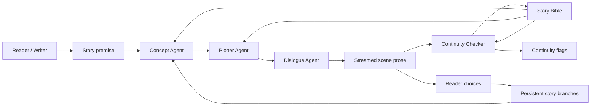
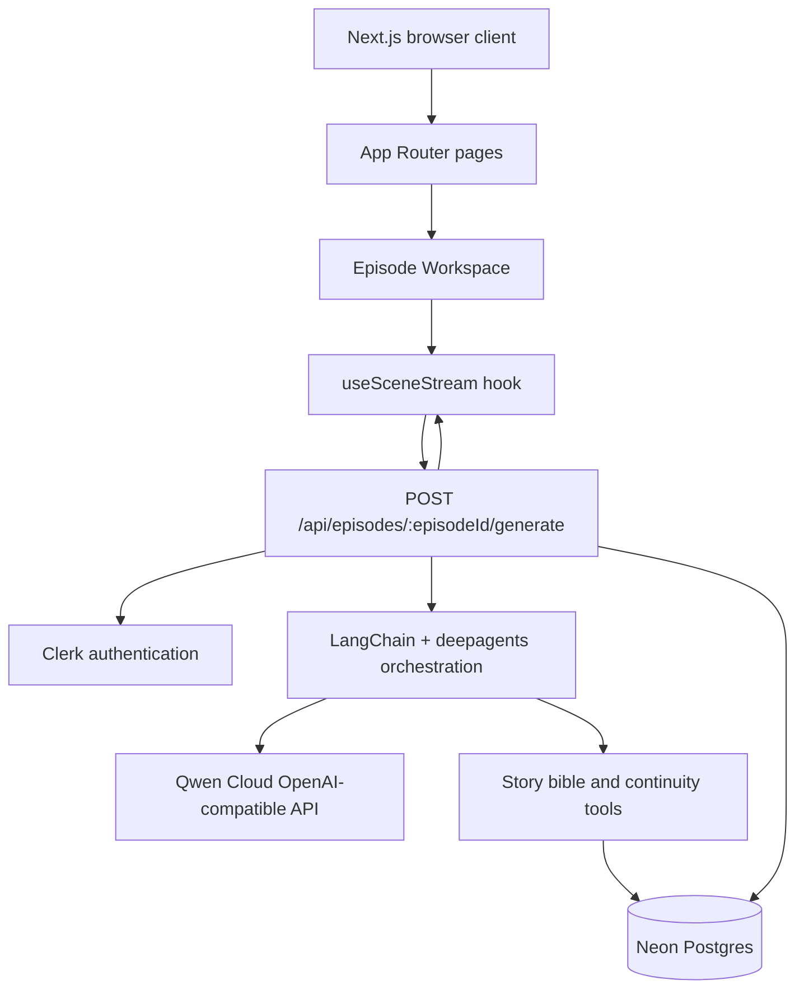
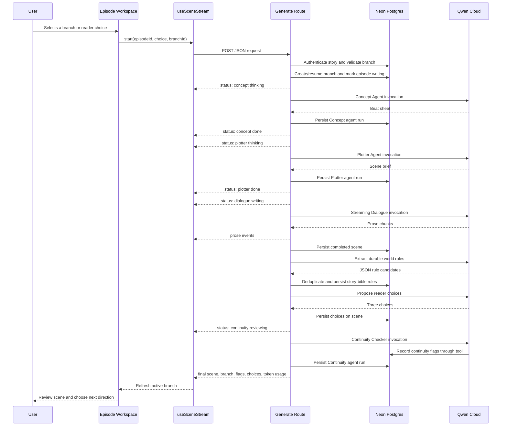
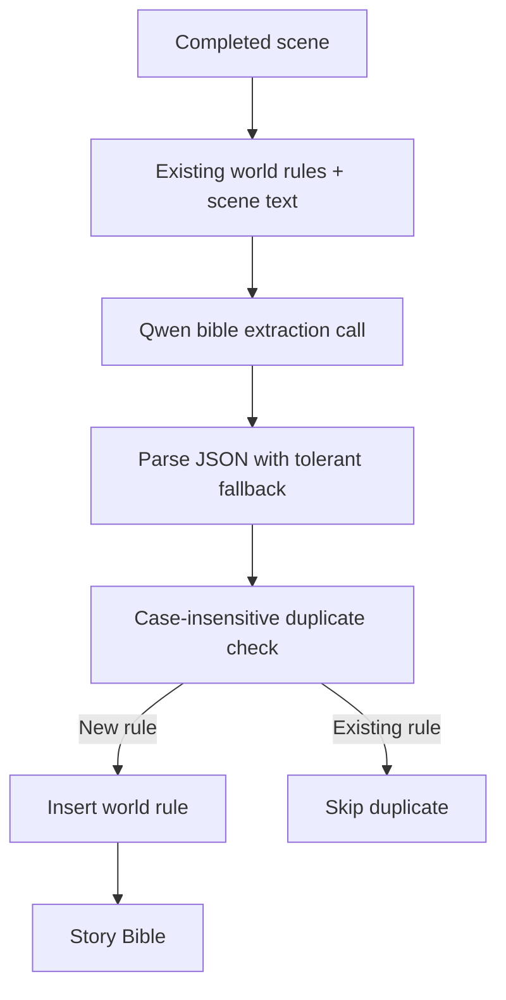
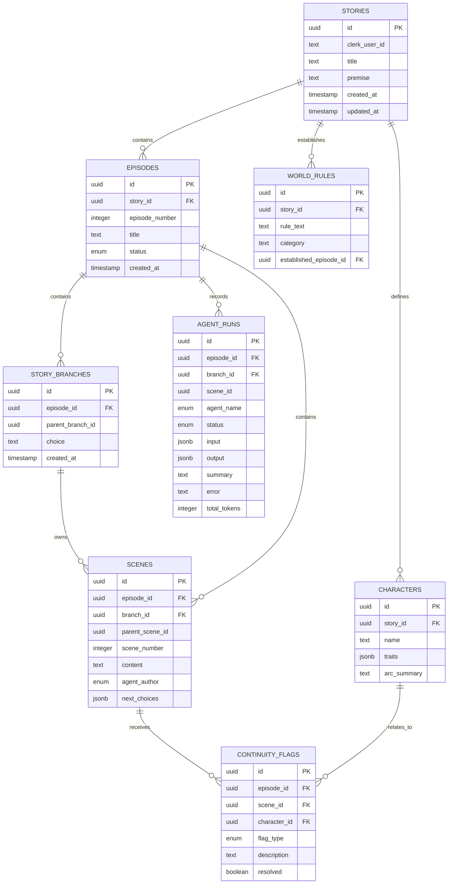
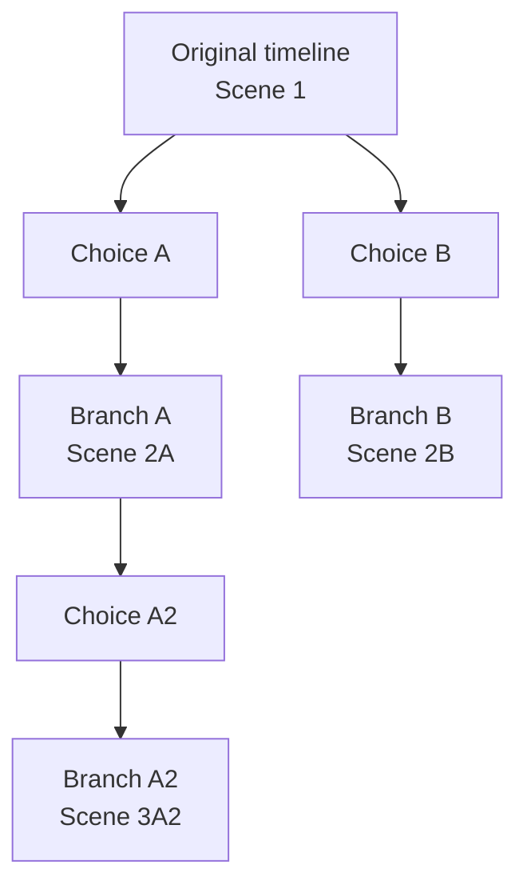
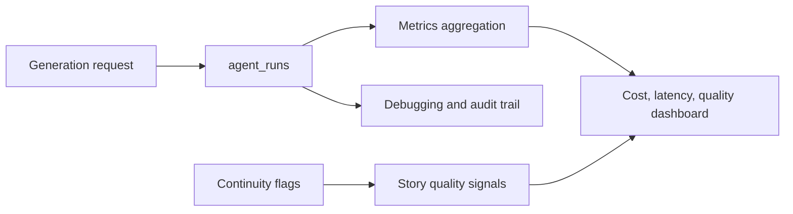
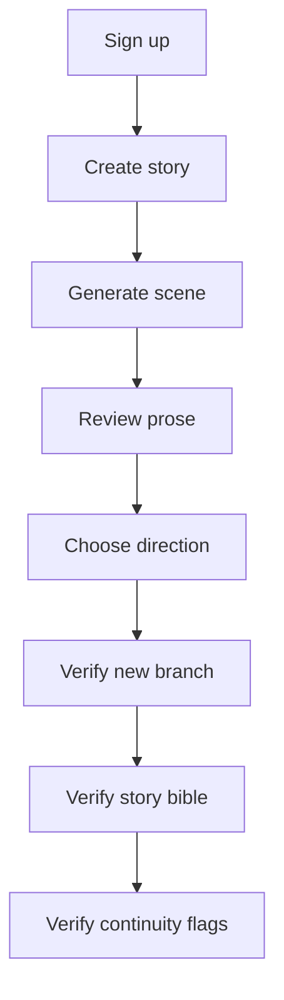

# Loom

Loom is a multi-agent writers' room for branching interactive fiction. You provide a premise, and a group of specialized Qwen-powered agents develops it scene by scene:

- **Concept Agent** proposes the next story beats and helps grow the story bible.
- **Plotter Agent** expands those beats into a concrete scene brief.
- **Dialogue Agent** writes the scene and streams the prose live to the browser.
- **Continuity Checker** reviews the completed scene against the story bible and records contradictions, character drift, or unresolved threads.
- **Showrunner UI** exposes the handoffs, agent status, generated prose, choices, branches, and continuity notes as one writers' room workspace.

Loom is designed for the **AI Showrunner** track of the Global AI Hackathon Series with Qwen Cloud, with additional strengths in persistent memory and multi-agent collaboration.

## Product Overview

Loom treats an interactive story as a living writers' room rather than a single prompt-and-response interaction.



The result is an episodic story that can evolve in multiple directions while retaining its characters, setting rules, and unresolved narrative threads.

## Core Features

### Multi-agent writers' room

Each generation passes through specialized roles instead of asking one model to perform every task at once. This makes the pipeline easier to understand, easier to debug, and more compelling to demonstrate.

### Live generation

The Dialogue Agent streams prose to the browser while the writers' room updates its agent statuses. The interface shows when agents are thinking, writing, reviewing, or finished.

### Persistent story bible

Loom stores characters and world rules in Postgres through Drizzle ORM. World facts extracted from completed scenes are deduplicated and associated with the episode that established them.

### Continuity checking

The Continuity Checker reads the current story bible and can record:

- Contradictions with established facts.
- Character drift, such as personality or trait changes.
- Unresolved narrative threads.

Flags appear inline in the manuscript and remain attached to their scene.

### Branching interactive fiction

Completed scenes can offer three reader-facing directions. Selecting a direction creates a persistent child branch. The original timeline and alternate paths remain available through the Story paths selector.

### Review-driven workflow

Loom generates one scene at a time. The user reviews the prose and continuity notes, then explicitly chooses the next direction or starts an unsteered scene. Full autonomous episode generation is intentionally deferred so the human remains in the creative loop.

### Token visibility

The stream reports best-effort token usage for the scene generation pipeline. The workspace displays this usage after a completed generation so the cost and performance characteristics remain visible during a demo.

## Architecture

### High-level system architecture



### Technology stack

| Layer | Technology | Responsibility |
| --- | --- | --- |
| Frontend | Next.js 16 App Router | Server-rendered pages and client workspace interactions |
| UI | Tailwind CSS v4, shadcn/ui, Base UI | Design system, responsive layout, controls, cards, tabs, select, textarea |
| Authentication | Clerk v7 | Sign-in, sign-up, session identity, route ownership checks |
| Backend | Next.js Route Handlers | Authenticated generation endpoint and NDJSON streaming |
| Agent orchestration | LangChain, `deepagents` | Qwen model adapters, specialized agents, tool access |
| Model provider | Qwen Cloud | OpenAI-compatible text generation endpoint |
| Database | Neon Postgres | Stories, episodes, scenes, branches, story bible, flags, and agent runs |
| ORM | Drizzle ORM | Typed schema definitions and database queries |
| Language | TypeScript | Shared types across server and client |

### Request and generation sequence



## Agent Design

### Concept Agent

The Concept Agent proposes a short beat sheet for the next scene. It reads existing characters and world rules and can update the story bible through tools.

Its responsibilities are deliberately narrow:

1. Read established story facts.
2. Suggest the next scene's dramatic beats.
3. Identify possible new character traits or setting facts.
4. Propose reader-facing directions after a scene is written.

### Plotter Agent

The Plotter Agent transforms the beat sheet into a scene brief containing the setting, point of view, emotional movement, and intended ending. This creates a stable handoff between planning and prose generation.

### Dialogue Agent

The Dialogue Agent receives the scene brief and writes prose directly through a streaming Qwen call. It is streamed separately from the deep-agent invocations because the browser needs to receive prose tokens as they are generated.

### Continuity Checker

The Continuity Checker receives the completed scene and reads the current story bible. When it identifies an issue, it calls the bound continuity tool with a human-readable description. Database IDs are bound in closures instead of being requested from the model, reducing the chance of malformed opaque identifiers.

### Story bible extraction

The generation route performs an explicit post-scene extraction pass. This is intentionally separate from optional Concept Agent tool calls. It ensures that durable facts from the actual prose can be persisted even when a model chooses not to call a write tool.

The extraction flow is:



## Streaming Protocol

The generation endpoint returns newline-delimited JSON rather than one large response. Each line is a complete JSON event.

### Endpoint

```text
POST /api/episodes/{episodeId}/generate
Content-Type: application/json
```

### Request body

```json
{
  "choice": "Follow the new door before it disappears",
  "branchId": "optional-active-branch-uuid"
}
```

Both fields are optional. Omitting `choice` produces an unsteered continuation. Omitting `branchId` uses or creates the episode's root branch.

### Status event

```json
{
  "type": "status",
  "agent": "continuity",
  "status": "reviewing",
  "summary": "Cross-referencing established world rules"
}
```

Possible agent statuses include:

- `thinking`
- `writing`
- `reviewing`
- `done`
- `error`

### Prose event

```json
{
  "type": "prose",
  "text": "The door opened onto a corridor that had not been there yesterday."
}
```

### Final event

```json
{
  "type": "final",
  "sceneId": "scene-uuid",
  "branchId": "branch-uuid",
  "parentBranchId": "parent-branch-uuid-or-null",
  "choice": "Follow the new door before it disappears",
  "choices": [
    "Step through before the hallway changes",
    "Call Mara and wait for backup",
    "Mark the door and investigate the blueprints"
  ],
  "status": "complete",
  "continuityFlags": [],
  "totalTokens": 1842
}
```

### Error event

```json
{
  "type": "error",
  "message": "Generation failed"
}
```

The route resets the episode status to `drafting` after an error, and the active agent run is marked as failed when possible.

## Data Model



### Branch behavior

The root branch represents the original timeline. Selecting a reader choice creates a child branch whose `parentBranchId` points to the active branch. A scene generated on a child branch includes the scenes inherited from its ancestors when building context.



Legacy scenes created before branches were introduced remain readable because scenes with a null `branchId` are treated as part of the visible root history.

## Project Structure

```text
loom/
├── app/
│   ├── api/
│   │   └── episodes/[episodeId]/generate/route.ts
│   ├── stories/
│   │   ├── new/
│   │   │   ├── actions.ts
│   │   │   └── page.tsx
│   │   ├── [storyId]/
│   │   │   ├── bible/page.tsx
│   │   │   └── episodes/[episodeId]/page.tsx
│   │   └── page.tsx
│   ├── layout.tsx
│   ├── page.tsx
│   └── globals.css
├── components/
│   ├── loom/
│   │   ├── episode-workspace.tsx
│   │   ├── manuscript-panel.tsx
│   │   ├── story-bible-panel.tsx
│   │   ├── writers-table.tsx
│   │   ├── continuity-flag-marker.tsx
│   │   └── story-card.tsx
│   └── ui/
│       ├── button.tsx
│       ├── card.tsx
│       ├── select.tsx
│       ├── tabs.tsx
│       └── textarea.tsx
├── db/
│   ├── index.ts
│   └── schemas/
│       ├── stories.ts
│       ├── episodes.ts
│       ├── branches.ts
│       ├── scenes.ts
│       ├── characters.ts
│       ├── world-rules.ts
│       ├── continuity-flags.ts
│       ├── agent-runs.ts
│       ├── enums.ts
│       └── relations.ts
├── hooks/
│   └── use-scene-stream.ts
├── lib/
│   ├── qwen.ts
│   ├── types.ts
│   └── agents/
│       ├── showrunner.ts
│       └── tools.ts
├── proxy.ts
├── drizzle.config.ts
└── package.json
```

## Local Development

### Prerequisites

- Node.js compatible with the installed Next.js version.
- A Neon Postgres database.
- A Clerk application.
- A Qwen Cloud account and API key.

### Install dependencies

```bash
npm install
```

On Windows PowerShell environments where `npm.ps1` is blocked by execution policy, use:

```powershell
npm.cmd install
```

### Environment variables

Create a `.env` file in the project root:

```env
DATABASE_URL=postgresql://...

NEXT_PUBLIC_CLERK_PUBLISHABLE_KEY=pk_...
CLERK_SECRET_KEY=sk_...
NEXT_PUBLIC_CLERK_SIGN_IN_URL=/sign-in
NEXT_PUBLIC_CLERK_SIGN_UP_URL=/sign-up
NEXT_PUBLIC_CLERK_SIGN_IN_FALLBACK_REDIRECT_URL=/stories
NEXT_PUBLIC_CLERK_SIGN_UP_FALLBACK_REDIRECT_URL=/stories

QWEN_API_KEY=sk-...
QWEN_MODEL=qwen-max
```

Loom uses the Qwen Cloud OpenAI-compatible endpoint:

```text
https://dashscope-intl.aliyuncs.com/compatible-mode/v1
```

The endpoint is configured in `lib/qwen.ts`; the API key must remain server-side.

### Database setup

Push the current Drizzle schema to the development database:

```bash
npm run db:push
```

On Windows:

```powershell
npm.cmd run db:push
```

The schema includes the branch-specific scene uniqueness constraint:

```text
(branch_id, scene_number)
```

This replaces the previous episode-wide scene uniqueness rule so sibling branches can each contain a Scene 2.

### Start the development server

```bash
npm run dev
```

Open [http://localhost:3000](http://localhost:3000).

### Useful scripts

| Script | Purpose |
| --- | --- |
| `npm run dev` | Start the Next.js development server |
| `npm run build` | Build the production application |
| `npm run start` | Start the production server |
| `npm run typecheck` | Run TypeScript validation |
| `npm run lint` | Run ESLint |
| `npm run format` | Format TypeScript and TSX files |
| `npm run db:push` | Push schema changes directly to the database |
| `npm run db:generate` | Generate Drizzle migration artifacts |
| `npm run db:migrate` | Apply generated migrations |
| `npm run db:check` | Validate Drizzle migration state |

## Authentication and Security

Clerk is the source of truth for identity. Loom stores the authenticated Clerk user ID on each story and filters story access by that ID.

The generation route validates:

1. The request has an authenticated Clerk user.
2. The episode exists.
3. The episode belongs to a story owned by the authenticated user.
4. Any requested branch belongs to the requested episode.

The Qwen key and database connection string are server-only values. They must not be prefixed with `NEXT_PUBLIC_` and must never be sent to the browser.

## Error Handling and Recovery

Generation is intentionally best-effort around optional enhancements:

- Choice generation failure does not discard the generated scene.
- Story-bible extraction failure does not discard prose or continuity results.
- Continuity failure resets the episode to a draftable state and emits an error event.
- Agent run records retain error messages and completion timestamps when available.
- The client guards against fast double-clicks with a synchronous streaming ref.
- The server also rejects generation when an episode is already marked `writing`.

## Demo Walkthrough

For a strong hackathon demonstration:

1. Open Loom and sign in.
2. Create a story with a premise that contains a memorable setting rule.
3. Start Episode 1.
4. Show the Concept and Plotter status transitions.
5. Let Dialogue stream the opening scene live.
6. Switch to the Story Bible tab and show extracted characters and world rules.
7. Point out any inline Continuity note.
8. Select one of the three reader choices.
9. Show that the Story paths selector now contains the original timeline and the selected branch.
10. Switch branches to demonstrate that alternate paths remain available.
11. Generate another scene and show the branch-specific continuity context.

## Troubleshooting

### The Story paths selector only shows Original timeline

Branches are created when a reader choice is selected, not when the root scene is generated. Generate a scene, wait for the choices section, and select one of the choices.

If the Concept Agent reports `No choices proposed`:

- Confirm `QWEN_API_KEY` is present.
- Restart the development server after environment changes.
- Check the generation request in the browser Network panel.
- Check the server terminal for Qwen request errors.

### Story Bible has no world rules

World-rule extraction runs after newly generated scenes. Existing scenes created before the extraction pass are not automatically backfilled. Generate another scene or add a dedicated backfill workflow in a future iteration.

### Database push asks about a unique constraint

The intended unique constraint is:

```text
scenes_branch_id_scene_number_unique
```

It covers `(branch_id, scene_number)`. The old episode-wide constraint on `(episode_id, scene_number)` must not remain because it prevents sibling branches from using the same scene number.

### Streaming appears buffered

The route sends:

```text
Content-Type: application/x-ndjson; charset=utf-8
Cache-Control: no-cache, no-transform
X-Accel-Buffering: no
```

If deployed behind a reverse proxy, disable proxy buffering and ensure the request timeout is longer than the expected Qwen generation time.

### TypeScript or dependency problems

Run:

```bash
npm run typecheck
npm run lint
```

On Windows PowerShell, use `npm.cmd` if the PowerShell npm wrapper is blocked.

## Deployment Notes

Before deploying:

1. Configure all Clerk, Neon, and Qwen environment variables in the hosting provider.
2. Apply the Drizzle schema to the production database using a controlled migration process.
3. Confirm the production reverse proxy does not buffer NDJSON responses.
4. Confirm serverless request duration limits accommodate multi-agent generation.
5. Confirm the Qwen API key is not exposed in client bundles.
6. Run `npm run build` with production environment variables.

For a production deployment, prefer generated and reviewed migrations over repeatedly using `db:push` against a shared database.

## Observability Opportunities

The current `agent_runs` table provides a foundation for operational visibility. Useful metrics to add include:

- Generation duration by agent.
- Token usage by agent and story.
- Qwen request failure rate.
- Choice-generation success rate.
- Number of continuity flags per episode.
- Average number of branches per story.
- Story-bible growth per episode.
- Percentage of scenes that require regeneration.



## Testing Strategy

The current baseline validation is TypeScript type-checking:

```bash
npm run typecheck
```

Recommended automated coverage:

### Unit tests

- Parse valid and fenced JSON choice responses.
- Parse world-rule extraction responses.
- Deduplicate rules case-insensitively.
- Resolve branch ancestry.
- Build the correct visible scene path.

### Route tests

- Reject unauthenticated requests.
- Reject branches belonging to another episode.
- Reject a second generation while the episode is writing.
- Emit status, prose, final, and error events in the expected format.
- Persist scene, branch, agent run, choices, and flags.

### Component tests

- Render the Writers Table and Story Bible tabs.
- Show the selected branch label rather than its UUID.
- Render the Story Bible empty states.
- Render continuity markers and descriptions.
- Submit the new story form through the server action.

### End-to-end tests



## Design Principles

### Make agent collaboration visible

The writers' room is part of the product experience. Agent status and handoff summaries should remain understandable to a human observer.

### Keep IDs out of model decisions

Opaque database IDs are bound in server-side tool closures whenever possible. Models should work with names and narrative concepts, while the server owns identity and relationships.

### Persist the meaningful checkpoints

Scenes, choices, branches, story-bible changes, continuity flags, and agent runs are stored so a long generation flow can be inspected and resumed.

### Fail softly around optional intelligence

Choice suggestions and bible extraction improve the experience but should not destroy successfully generated prose if they fail.

### Keep the human in the creative loop

The user chooses when to continue, which branch to follow, and which continuity issues to review.

## Future Scope

### Near-term product improvements

- Backfill story-bible rules and characters from existing scenes.
- Add editable character and world-rule forms.
- Add continuity flag resolution and dismissal actions.
- Add scene regeneration with version history.
- Add branch names and branch summaries instead of raw choice labels.
- Add episode completion controls and episode-to-episode progression.
- Add an agent transcript drawer with full handoff inputs and outputs.

### Advanced orchestration

- Replace the sequential route pipeline with a durable LangGraph state machine.
- Add approval checkpoints between Concept, Plotter, Dialogue, and Continuity.
- Allow parallel Concept and continuity research where dependencies permit.
- Add a Showrunner agent that decides when to retry, revise, or escalate to the user.
- Add automatic scene revision from resolved continuity flags.

### Memory and retrieval

- Add semantic embeddings for scenes, characters, rules, and unresolved threads.
- Retrieve only relevant story-bible facts for long stories.
- Summarize old episodes into compact memory blocks.
- Add memory provenance showing which scene established each fact.
- Add a searchable story-bible interface.

### Richer interactive fiction

- Add branch comparison views.
- Add a visual story graph.
- Add checkpoints and save slots.
- Add reader profile preferences.
- Support multiple endings and convergence points.
- Add scene-level rewinds and alternate-choice replay.

### Creative formats

- Script and screenplay formatting.
- Audio narration with multiple character voices.
- Illustrated scene cards.
- Interactive dialogue mode.
- Podcast and episodic audio production.
- Narrative game integration.

### Production readiness

- Add rate limiting and per-user generation quotas.
- Add request cancellation and abort propagation to Qwen.
- Add retry policies with exponential backoff.
- Add durable job processing for long episodes.
- Add structured audit logs.
- Add provider fallback support.
- Add cost budgets and token alerts.
- Add content safety and moderation workflows.

## License and Hackathon Context

Loom is being developed for the Global AI Hackathon Series with Qwen Cloud. Qwen Cloud is accessed through its OpenAI-compatible API, and the project is designed to demonstrate creative multi-agent orchestration, persistent memory, visible collaboration, and branching story generation.
